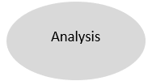
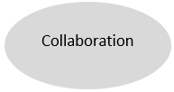
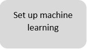

# Starting on the Advanced Analytics Workspace

The
**[Advanced Analytics Workspace portal](https://portal.covid.cloud.statcan.ca)**
is a great place to discover and connect to the available resources we'll be
talking about here.

[]

[]

[]

[]

# Get Started with AAW

Everything starts with
**[Kubeflow](1-Experiments/Kubeflow/)**!
Start by setting it up. 

You're going to have questions. Join our 
**[Slack channel](https://statcan-aaw.slack.com/)**
so we can get you answers! 

# Experiments
## Process data using `R`, `Python`, or `Julia` 

Once you have Kubeflow set up, use 
**[Jupyter Notebooks](1-Experiments/Jupyter/)**
to create and share docuements that contain live code, equations, or visualizations.

## Process data using 'R' or 'Python'

**[R Studio](1-Experiments/RStudio/)**
gives you an integrated development environment for R and Python. Use the r-studio-cpu image to get an R Studio environment.

## Run a virtual desktop 

You can run a full Ubuntu desktop, with typical applications, right inside your browser, using [**ML Workspaces**](1-Experiments/ML-Workspaces)

## Manage machine learning models and metadata

**[ML Flow](1-Experiments/MLflow/)**
lets you manage the machine learning lifecycle. It's a model registry for storing machine learning models and metrics.

# Publishing

## Build and publish an interactive dashboard

Use 
**[R-Shiny](/2-Publishing/R-Shiny/)** 
to build interactive web apps straight from R. You can deploy your R-Shiny dashboard by submitting a pull request to our
[R-Dashboards GitHub repository](https://github.com/StatCan/R-dashboards).

**[Dash](/2-Publishing/Dash/)** is a data visualization tool that lets you build an interactive GUI around your data analysis code.

## Explore your data

Use 
**[Datasette](/2-Publishing/Datasette/)**
, an instant JSON API for your SQLite databases. Run SQL queries in a more interactive way!

# Pipelines

## Build and schedule data/analysis pipelines

**[Kubeflow Pipelines](/3-Pipelines/Kubeflow-Pipelines/)** allows you to set up pipelines. Each pipeline encapsulates analytical workflows, and can be shared, reused, and scheduled.

[]
## Integrate with Platform as a Service (PaaS) offerings
We can integrate with many Platform as a Service (PaaS) offerings, like Databricks or AzureML.

# Collaboration
## Share code among team members

Use GitHub or GitLab to share code, or request a 
**[shared workspace](/Collaboration/)**
.

<!-- prettier-ignore -->
!!! tip "Ask for help in production"
    The Advanced Analytics Workspace support staff are happy to help with
    production oriented use cases, and we can probably save you lots of time.
    Don't be shy to [ask us for help](Help)!

# How do I get data? How do I submit data?

- Every workspace can be equipped with its own storage.

- There are also storage buckets to publish datasets; either for internal use or
  for wider release.

We will give an overview of the technologies here, and in the next sections
there will be a more in-depth description of each of them.

<!-- prettier-ignore -->
!!! example "Browse some datasets"
    Browse some [datasets](https://datasets.covid.cloud.statcan.ca) here. These
    data sets are meant to store widely shared data. Either data that has been
    brought it, or data to be released out as a product. **As always, ensure
    that the data is not sensitive.**
